CUDA Path Tracer
================

**University of Pennsylvania, CIS 565: GPU Programming and Architecture, Project 3**

* Mark Melkumyan
  * [LinkedIn](https://www.linkedin.com/in/mark-melkumyan/), [Portfolio](https://www.marklikes.art/)
* Tested on: Windows 11, i7-10750H @ 2.60GHz, 64GB RAM, GTX 1650 Ti 4096MB

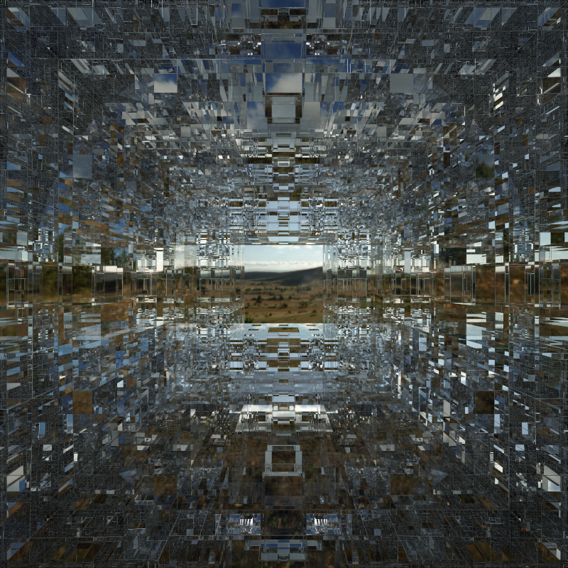

> Glass Menger Fractal POV | 800x800 px | 1000 spp | depth 64 | `sdf_menger_glass.json` | `panorama_map` HDRI

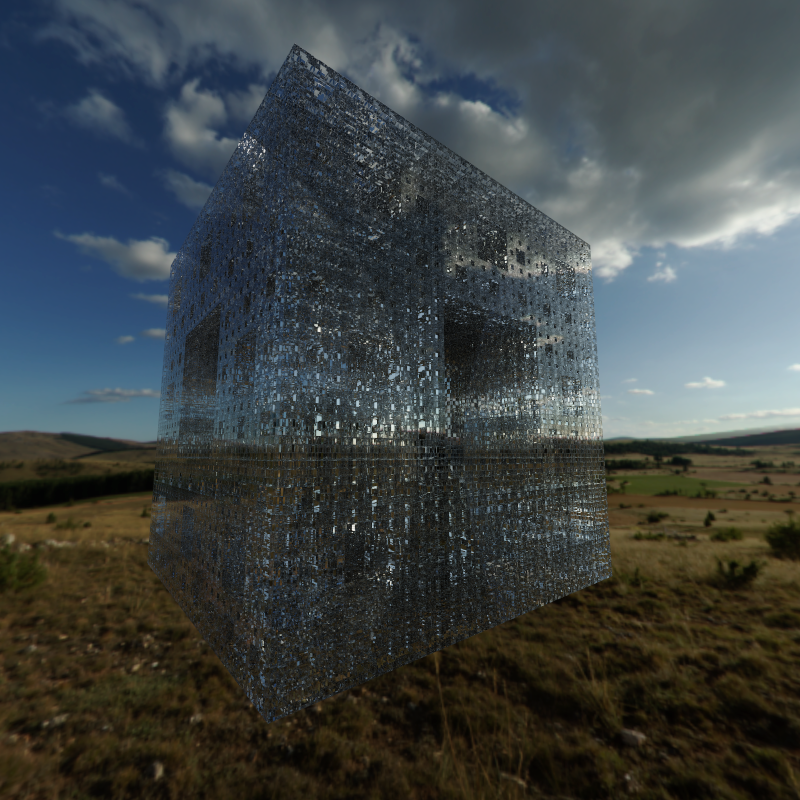

> Glass Menger Fractal | 800x800 px | 1000 spp | depth 64 | `sdf_menger_glass.json` (earlier camera) | `panorama_map` HDRI

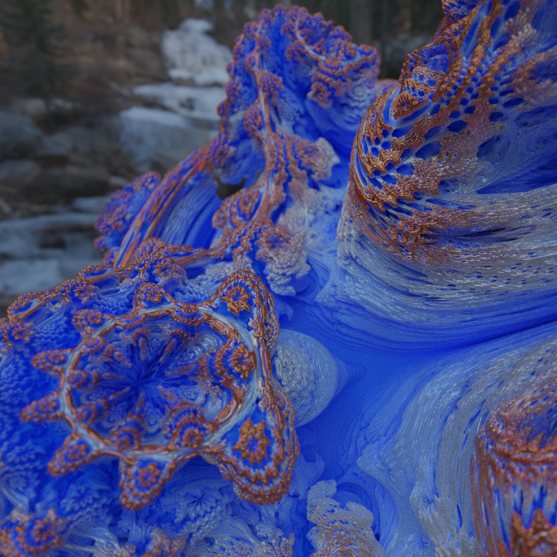

> Mandelbulb Closeup | 800x800 px | 1000 spp | depth 8 | `sdf_mandelbulb.json` | `Frozen_Waterfall_Ref` HDRI

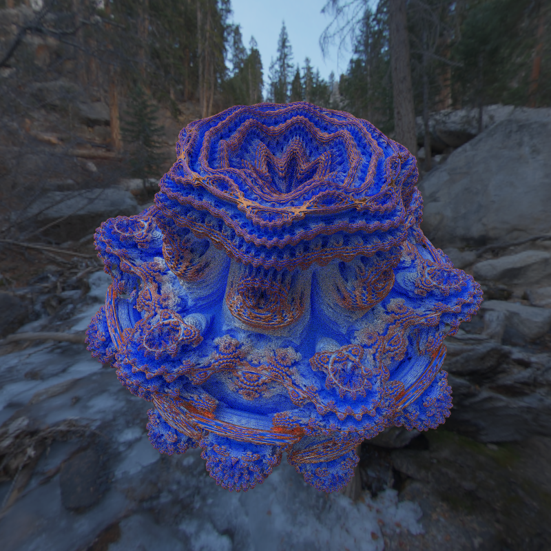

> Mandelbulb Wide | 800x800 px | 1000 spp | depth 8 | `sdf_mandelbulb_2.json` | `Frozen_Waterfall_Ref` HDRI

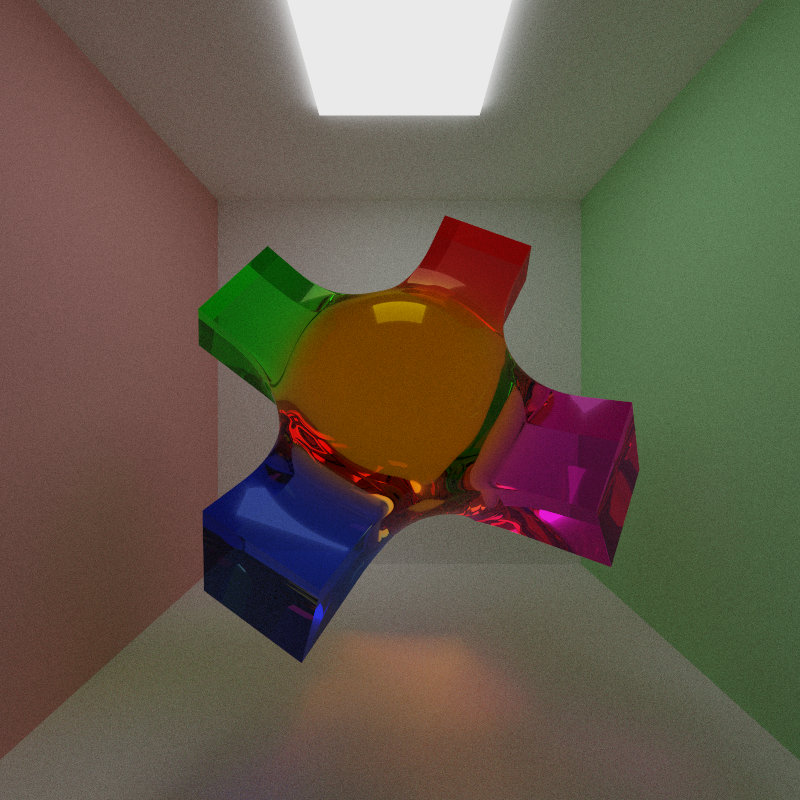

> Glass metaballs | 800x800 px | 1400 spp | depth 16 | `sdf_blob.json` | no HDRI

## What is this?

An offline CUDA path tracer with:

- **Diffuse, mirror and refractive glass BSDFs**: Glass fresnel computed using full dielectric Fresnel (PBRT's `FrDielectric`, not Schlick).
- **Stochastic antialiasing:** Each ray cast from the camera is sent from a random subpixel, achieving smoother edges.
- **Stream compaction of dead paths:** Dead path threads are removed each bounce, so the next bounce launches fewer threads. Beneficial in open scenes where rays often escape and terminate.
- **Material sorting:** Sort rays such that those with matching materials are adjacent in memory. In theory should improve performance for scenes with many objects or many materials, but benefits not seen in my scenes.
- **Raymarched SDF fractals**: Includes metaballs, Menger sponge, and Mandelbulb!
- **Procedural materials for SDFs**: Live generated textures of SDFs without the use of texture maps.
- **HDR environment map**: For more realistic ambient lighting of scenes. 
- **Physically based depth of field:** Widen the simulated area of the camera aperture, allowing for fine control of subject focus.
- **Exposure, Reinhard tone mapping and gamma:** Compresses unbounded HDR radiance values into a displayable range.

## Features

### Environment map

<p align="center">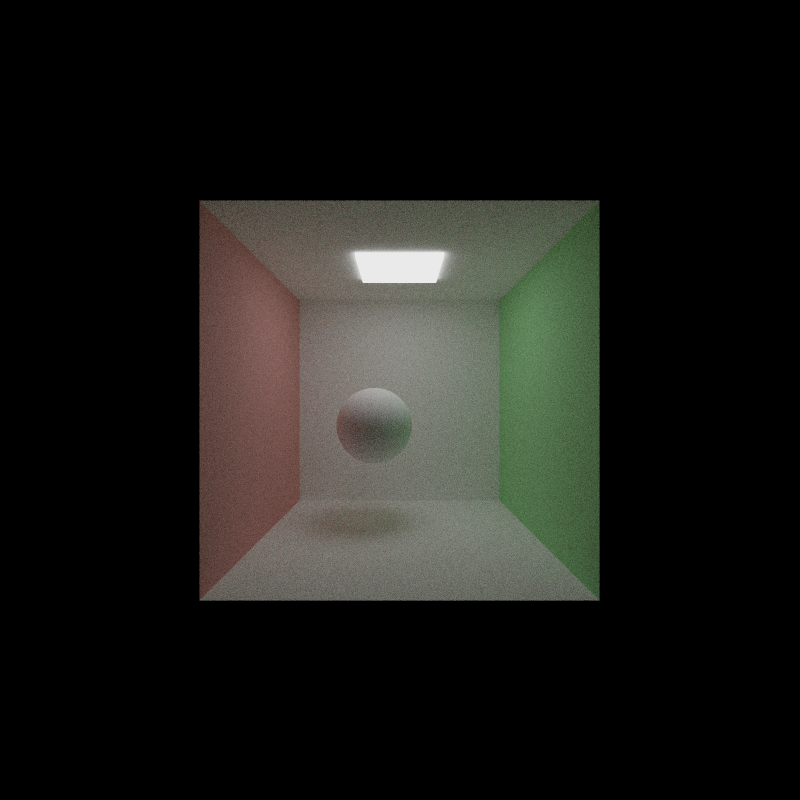 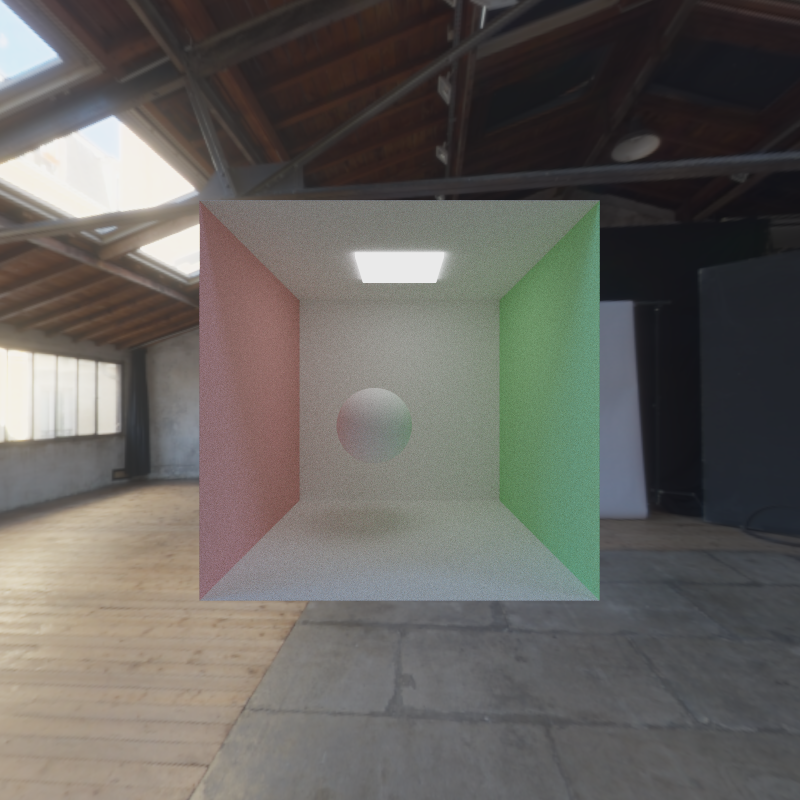</p>

Support for environment map HDRI files. Every path that escapes by hitting the skybox will sample the environment map texture instead of returning black.

---
### Depth of field

<p align="center">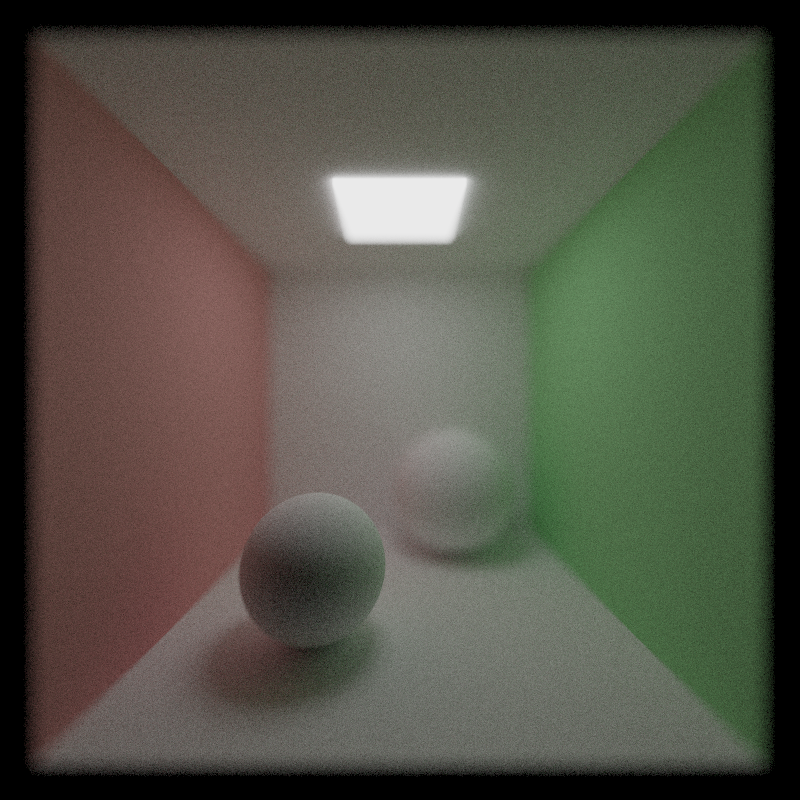 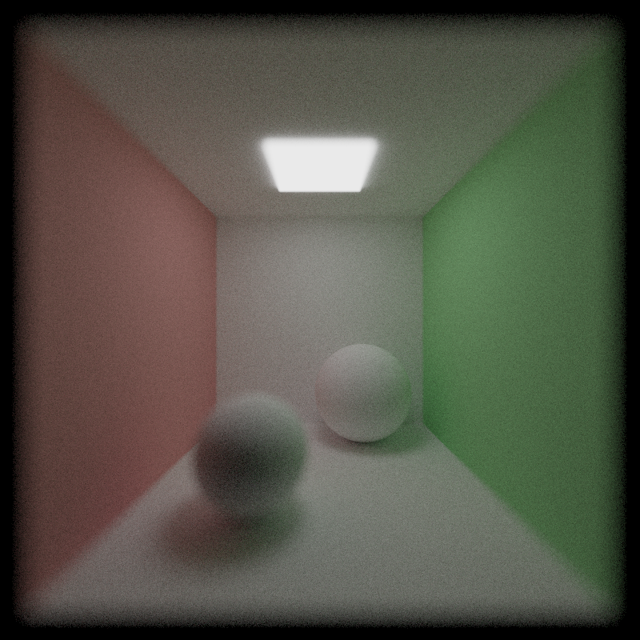</p>

Most simple renderers use a pinhole camera, where the aperture is an infinitely small point. This results in everything in the scene staying in focus. By considering the aperture as a disk, we can randomly sample a point on it as the ray origin. We may also set a focal distance at which objects in the scene are fully in focus. By adjusting both `LENS_RADIUS` and `FOCAL_DISTANCE` variables, a variety of depth of field shots may be achieved. 

---
### SDF fractals and procedural materials

Raymarching SDFs is achieved by stepping each ray based on the distance of the closest surface. We continue to iterate until we intersect a surface or the ray misses.

Normals are approximated by sampling the SDF at small offsets around the surface point (4 tetrahedral samples instead of 6). This is roughly the 3D equivalent of a sobel filter, but we take the derivative of the 3D surface function.

#### Metaballs 
Created by smooth unioning various SDF primitives to create more interesting shapes.

  <p align="center">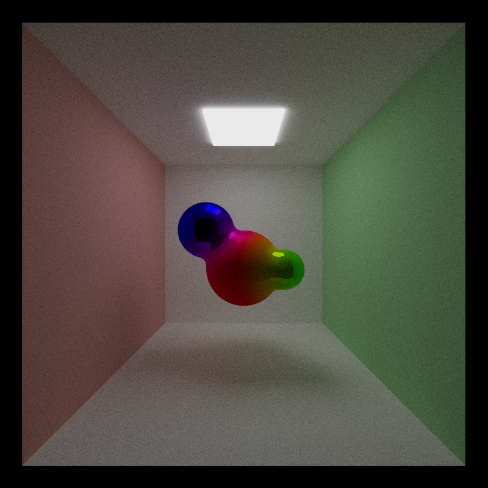</p>

#### Menger sponge fractal 
This shape is achieved by recursively subtracting a cross shape from a cube. This results in a sponge-like shape with continually smaller holes.

  <p align="center">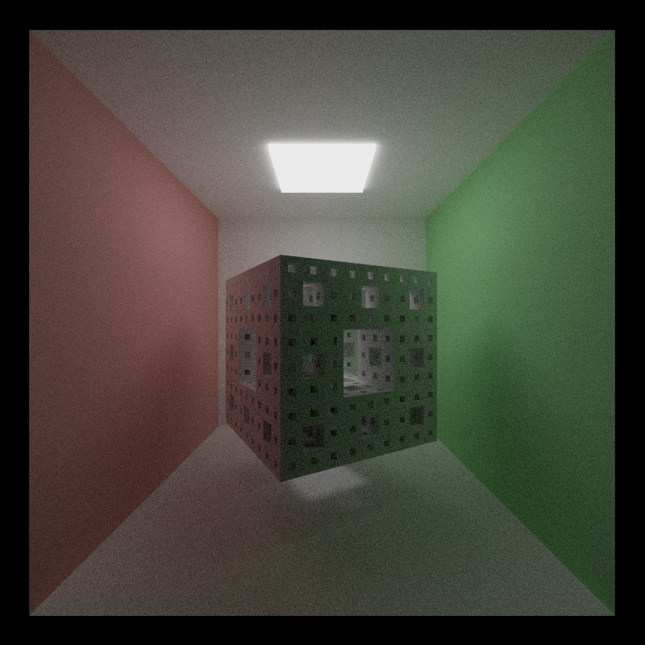</p>

#### Mandelbulb

The mandelbulb is a 3D version of the mandelbrot set, where each point is plugged into the formula `z^8 + c` (where the point is `z`). The raising to the 8th power is done in spherical coordinates to add radial symmetry. Points that never escape to infinity are inside the shape, which lets us define a boundary for the shape.

A procedural texture is applied by mapping the orbit trap value to a gradient color palette (see the hero renders above; the feature shot below is untextured to show the geometry).

  <p align="center">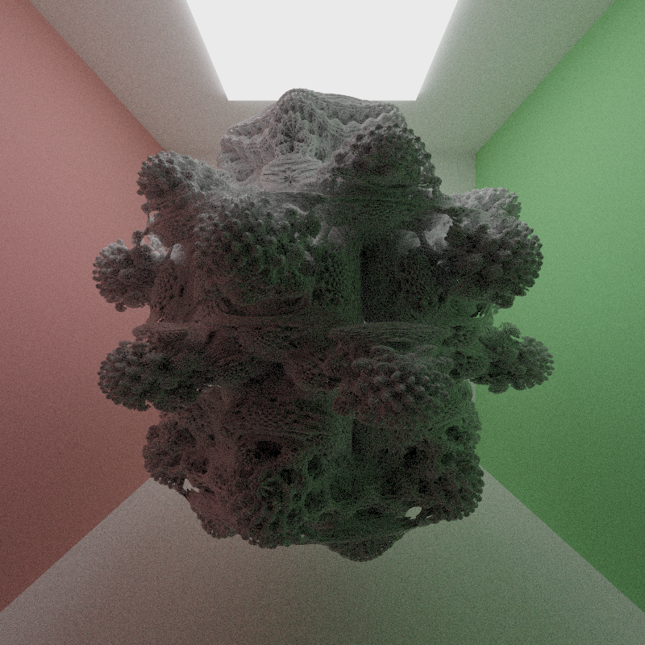</p>

---
### Refractive glass

<p align="center">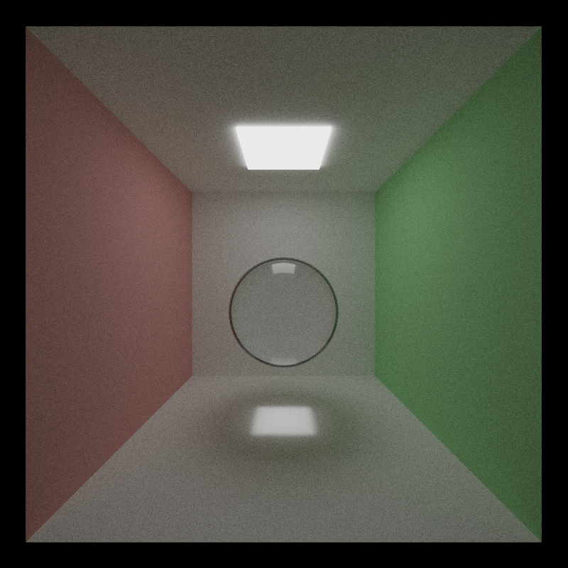 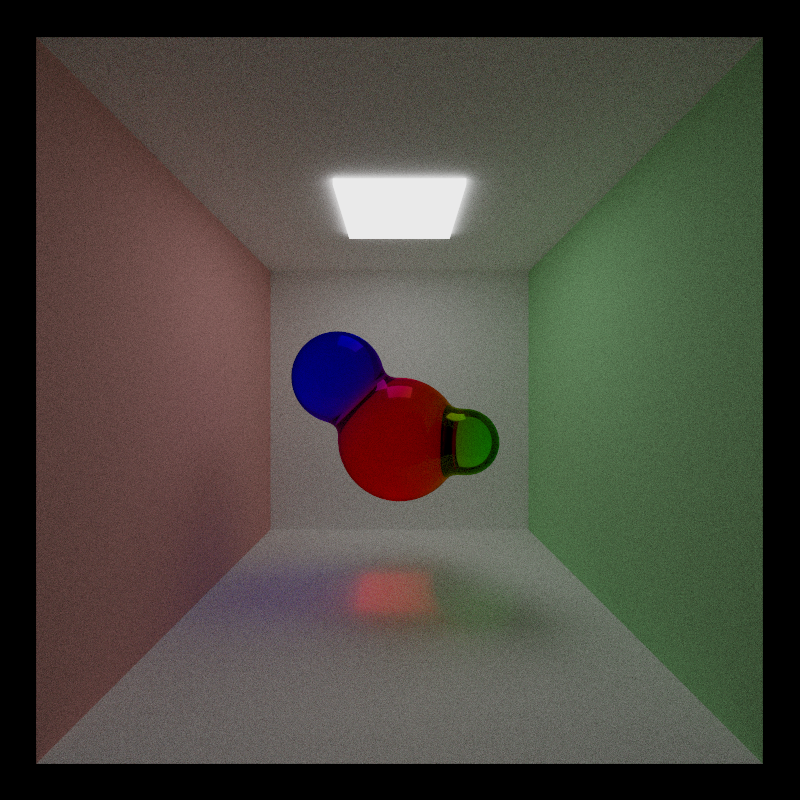</p>

Refractive glass is achieved with help from Snell's law! Using `glm::refract` we bend rays through a surface, then back out the other side. The angle at which the ray bends is determined by the index of refraction (IOR). On the rims of glass surfaces the rays reflect instead of refracting, creating a mirror shine. This reflect/refract boundary is determined by the Fresnel equation. This material works on both analytic shapes and SDFs!

---
### Scene file additions

| Key | Where | Meaning |
|---|---|---|
| `environment_map` | top level | Path to a `.hdr` file |
| `"TYPE": "Refractive"` & `IOR` | material | Glass with index of refraction |
| `sdf_sphere`, `sdf_cube`, `sdf_metaballs`, `sdf_menger`, `sdf_mandelbulb`, `sdf_blob` | object `TYPE` | Raymarched SDF shapes |
| `LENS_RADIUS` | camera | Thin-lens aperture radius. 0 = pinhole |
| `FOCAL_DISTANCE` | camera | Distance to the plane in focus |
| `EXPOSURE` | camera | Multiplier before tone mapping |
| `GAMMA_CORRECTION` | camera | Apply gamma correction to the output |

## Performance analysis

Methodology:

- Release build, 800x800 resolution, max depth of 8 bounces.
- Timing done with CUDA events, excluding display and vsync timing.
- Each configuration runs 100 iterations, with median values recorded.
- Every scene shares one Cornell box and camera.

---
### Stream compaction: remaining paths per bounce

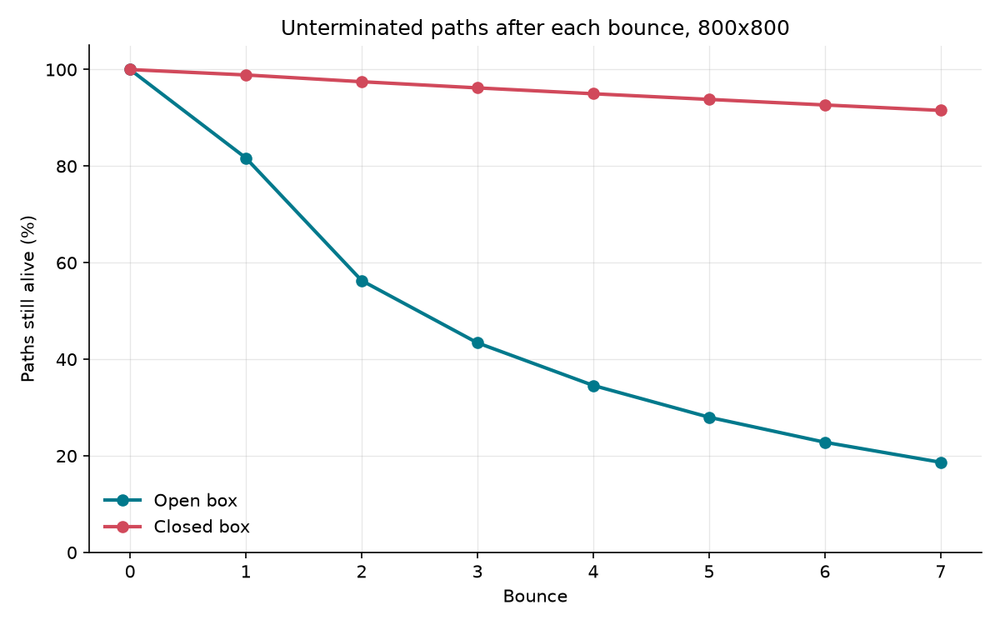

> stream compaction on, `thrust::partition` after every bounce

#### Notes:

- **Open box**: After 7 bounces, only 19% of paths remain after compaction. The open face of the box allows most rays to leave.
- **Closed box**: Paths only die when hitting the area light, so only ~1% are compacted away each bounce (8.5% total by bounce 7). 

---
### Stream compaction: cost

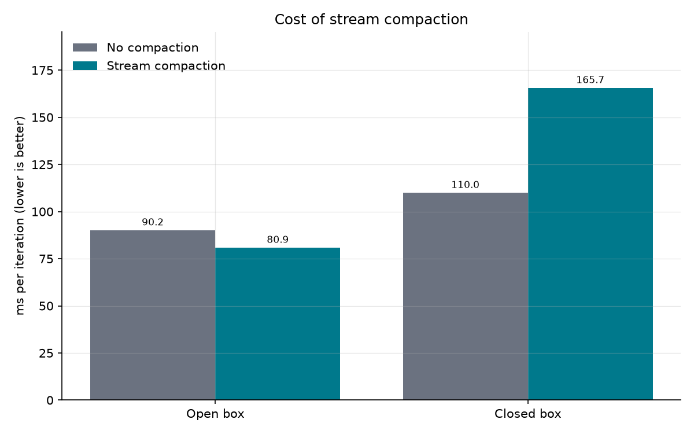

#### Table: Stream compaction (ms)

| Scene | No compaction | Compaction | Change |
|---|---:|---:|---:|
| Open box | 90.21 | 80.94 | -10.3% |
| Closed box | 110.04 | 165.66 | +50.6% |

> sort off

#### Notes:
- **Open Box**: Even in the best case, stream compaction offers minimal benefit without further optimization. Compaction cuts the total path-bounces traced roughly in half (2.47M vs 5.12M), yet frame time only drops 10%. This is likely because the early bounces dominate: the first three bounces account for 62% of all path-bounces traced, and compaction has barely removed anything by then (56% of paths are still alive after bounce 2). Each bounce also pays for a `thrust::partition` call and a device-to-host copy of the new path count, which contributes to the slowdown.
- **Closed Box**: In the worst case, stream compaction slows performance by 51% (frame time 110 ms to 166 ms). The overhead cost of running `thrust::partition` presents a significant slowdown.

---
### Material sorting: Cornell box

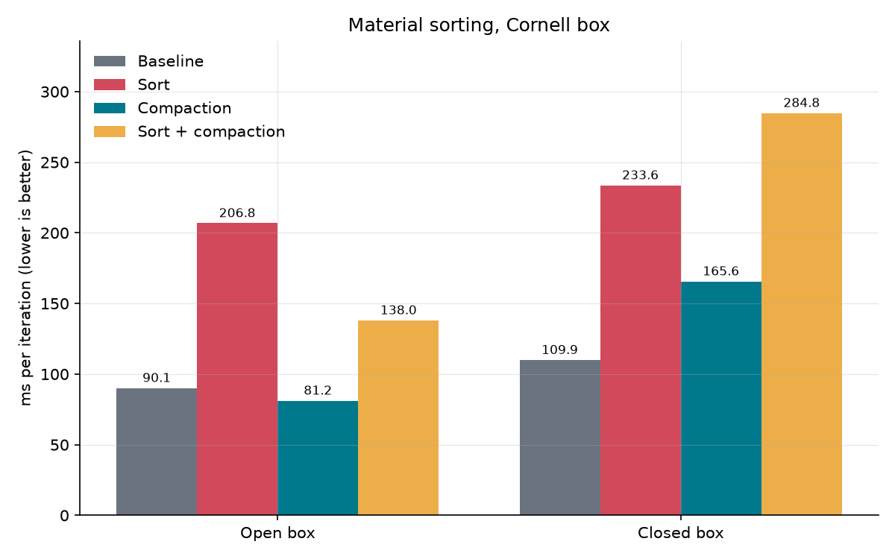

> `thrust::sort_by_key` on `ShadeableIntersection` by `materialId`, `PathSegment` as values

#### Notes:

- **Sort**: With only five materials and minimal objects in a scene, sorting each ray only offers a slowdown. Performance improvements likely require a substantial number of materials and/or objects.
- **Sort implementation choice**: Two implementations were tested: sorting by the struct `ShadeableIntersection.materialId`, which uses a merge sort under the hood, and sorting by a zipped array of just `materialId` ints, which uses radix sort under the hood. Radix sort is expected to perform better than merge sort, but the overhead of zipping an int-only array slows things too much.

---
### Environment map cost

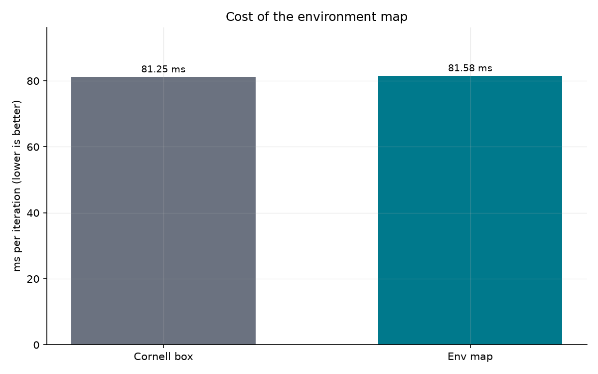

> open Cornell box, compaction on

#### Notes:

- **Effectively free!** It's just one texture fetch per escaped ray.
- **CPU comparison**: Also nearly free on a CPU, since it's still one lookup per escaped ray. 
- **Future work**: importance-sample the environment map. HDRI maps with intense small lights (such as the sun!) produce lots of fireflies. This is because the odds of a bounced ray hitting the sun is quite small (solid angle is low). Importance sampling the intense regions of the HDRI would improve convergence speed.

---
### Depth of field cost

#### Table: Cost of depth of field (ms)

| Cornell box | Depth of field | Change |
|---|---:|---:|
| 81.19 | 81.68 | +0.6% |

> open Cornell box, compaction on

#### Notes:

- **Effectively free.** Only camera rays change: a disk sample and a new direction, once per path.
- **CPU comparison**: Equally cheap per ray on a CPU. The real cost of DOF is convergence: blurred regions need many samples to smooth out, and the GPU's raw throughput is what makes that affordable.

---
### SDF fractals

#### A - Cost by shape

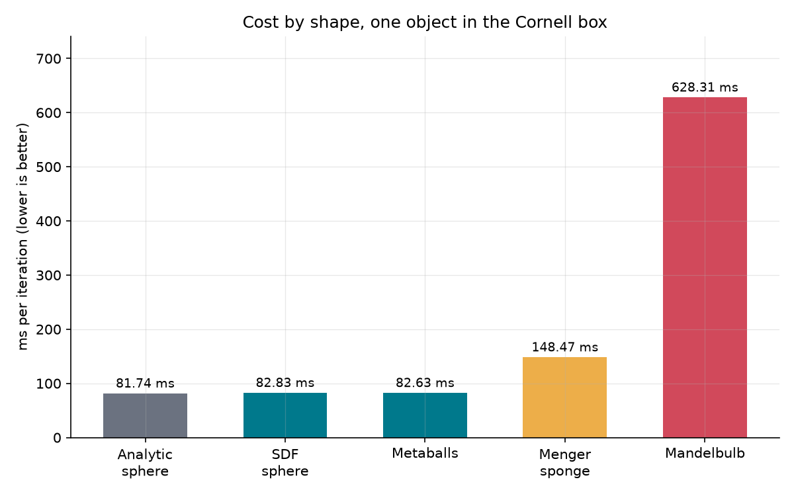

#### Table: Cost by shape (ms)

| Shape | ms | vs analytic sphere |
|---|---:|---:|
| Analytic sphere | 81.74 | 1.00x |
| SDF sphere | 82.83 | 1.01x |
| Metaballs | 82.63 | 1.01x |
| Menger sponge | 148.47 | 1.82x |
| Mandelbulb | 628.31 | 7.69x |

> one diffuse object centered in the open Cornell box, compaction on

#### Notes:
- Performance depends heavily on the intersection test calculated at each step. Spheres and metaballs are relatively simple, while the mandelbulb is much more time consuming.
- **Future work**: Optimize the mandelbulb code to improve performance.
- **CPU comparison**: Every pixel marches independently, so the work parallelizes perfectly. Step counts for each pixel may vary though, as grazing rays take more steps than rays that hit. Each GPU warp waits on the slowest thread it has, which will slow performance.

#### B - Max march steps

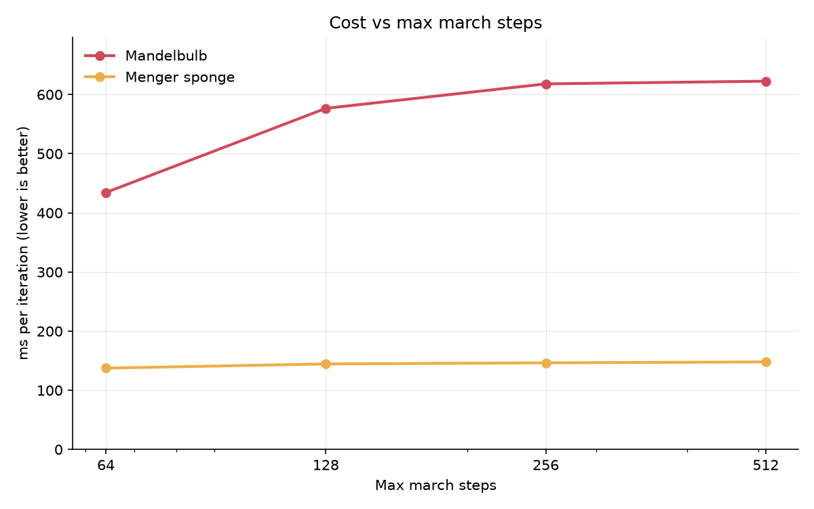
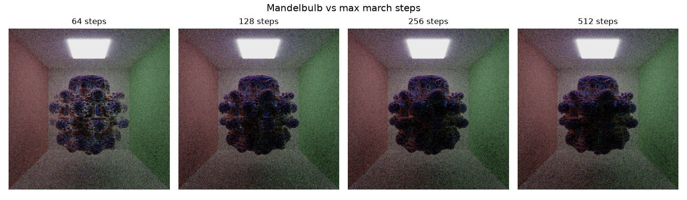

#### Notes:
- Lower max step counts prevent the raymarch from intersecting the surface in some regions, resulting in holes. Higher steps render a more complete form, while only taking slightly longer.
- Menger sponge only needs ~150 steps to reach the surface. Any more is just extra headroom. Mandelbulb benefits most from extra steps as its surface is much more detailed.

#### C - Hit epsilon

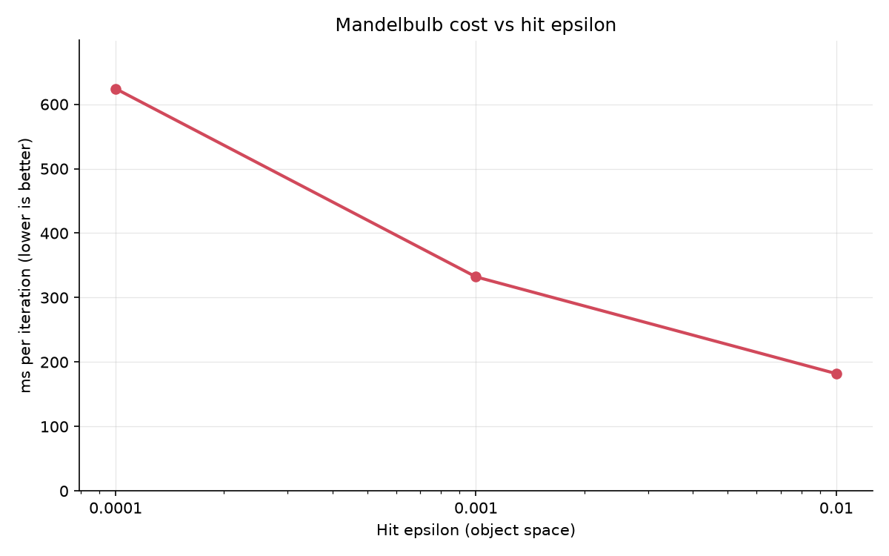
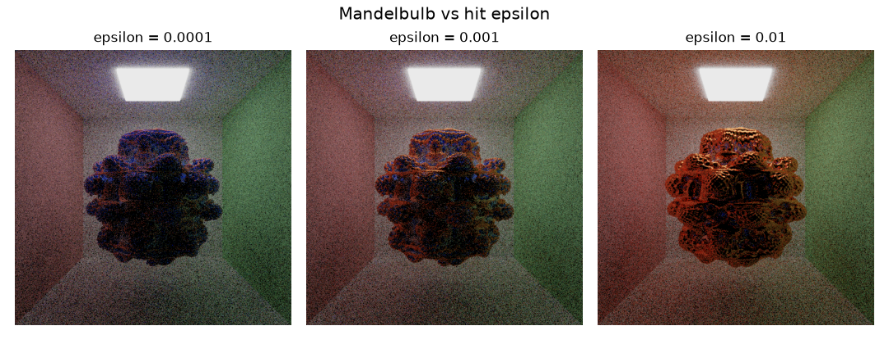

#### Notes:
- Lower hit epsilon increases the fine detail of the SDF, but takes more iterations of raymarching to hit the threshold. 

---
### Glass

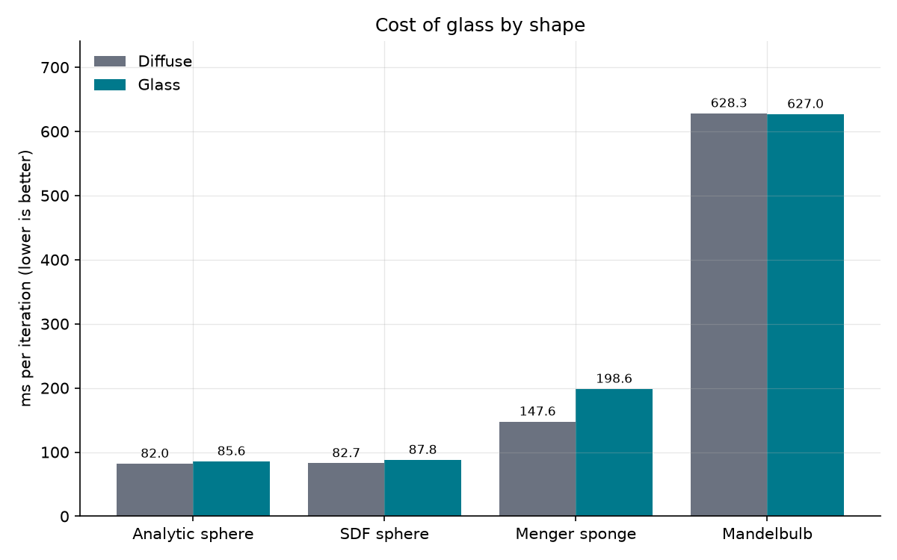
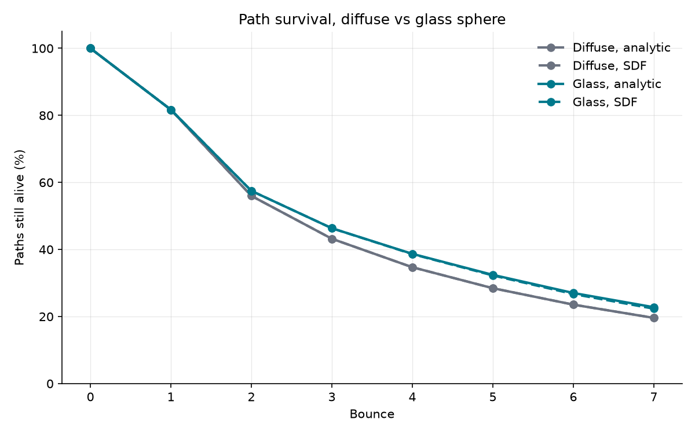

#### Table: Glass (ms)

| Shape | Diffuse | Glass | Change |
|---|---:|---:|---:|
| Analytic sphere | 82.03 | 85.63 | +4.4% |
| SDF sphere | 82.73 | 87.81 | +6.1% |
| Menger sponge | 147.59 | 198.60 | +34.6% |

> one object centered in the open Cornell box, IOR 1.5, compaction on

#### Notes:
- The main performance difference is likely due to glass rays living longer (22.8% vs 19.6% alive at bounce 7). Glass reflects or refracts instead of absorbing.
- Menger sponge glass performs the worst , as it has many internal faces. Internal rays keep reflecting off / refracting through the internal glass, which takes it longer to terminate.
- It's also worth noting that analytic and SDF glass performance matches quite closely.
- 

## Bloopers

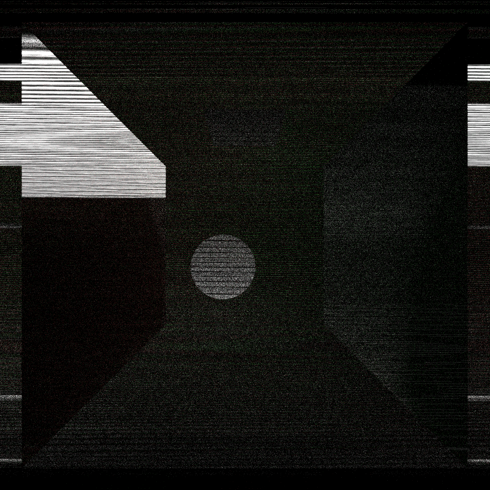

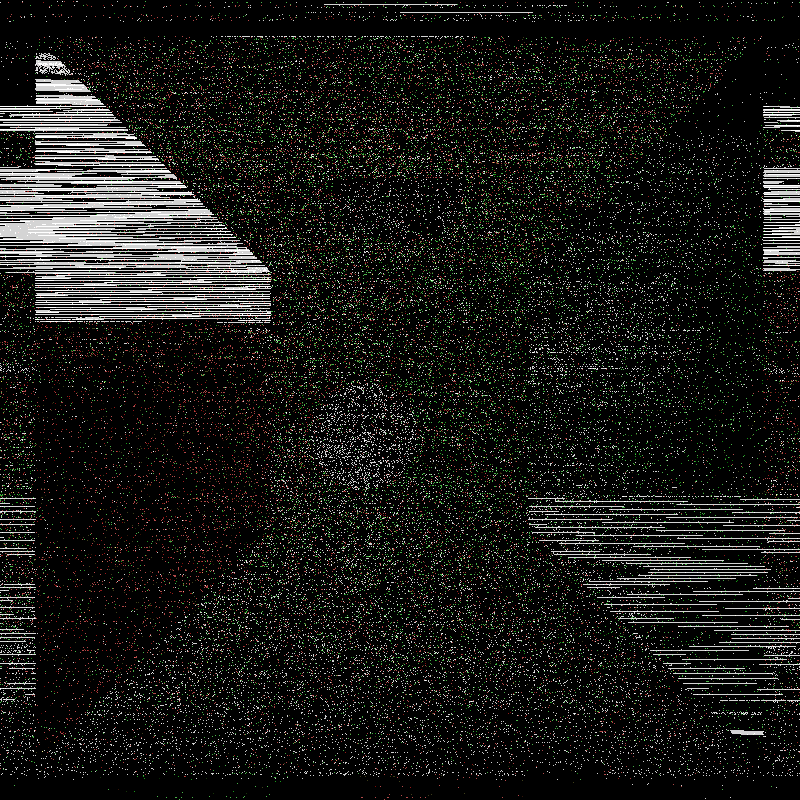

## References and credits

- [PBRTv4](https://pbr-book.org/4ed/contents): thin lens, dielectric BSDF
- Inigo Quilez: [distance functions](https://iquilezles.org/articles/distfunctions/), [smooth min](https://iquilezles.org/articles/smin/), [Menger fractal](https://iquilezles.org/articles/menger/), [Mandelbulb](https://iquilezles.org/articles/mandelbulb/), [SDF normals](https://iquilezles.org/articles/normalsSDF/)
- [thi.ng cosine gradients](https://dev.thi.ng/gradients/) for the procedural palettes
- HDRIs from CIS5610 course material

## Build Notes

### CMakeLists Changes

  Modified to pass `/Zc:preprocessor` to MSVC via nvcc:
  ```cmake
  if(MSVC)
      target_compile_options(${CMAKE_PROJECT_NAME} PRIVATE
          "$<$<COMPILE_LANGUAGE:CUDA>:-Xcompiler=/Zc:preprocessor>")
  endif()
  ```
  - This was done because my version of CUDA (13.3) gave me an error when MSVC was used as the preprocessor. I was unable to compile the Thrust-using sources (`pathtrace.cu`, `interactions.cu`) with it.